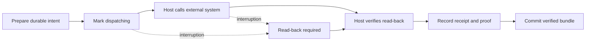
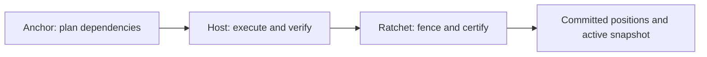

# Ratchet Runtime

**Execution safety and recoverable state for local agent workflows.**

Ratchet provides the deterministic machinery around work performed by an agent or
Python callback: ownership, verification, progress tracking, external-effect
recovery, and durable completion. It helps a host answer a concrete question:
**after a failure or restart, what actually completed, and what is safe to do next?**

> **Status: 0.6.0a1 — public experimental alpha.** Educational reference
> implementation for learning and local experiments. The new SQLite API is opt-in;
> the original Runner API remains available. Python 3.11+, local Linux/macOS
> storage, MIT license. See [validation evidence](docs/VALIDATION.md) and
> [deployment limits](#deployment-limits).

[Quick start](#quick-start) · [Choose an API](#choose-an-api) ·
[Recovery](#what-happens-after-an-interruption) · [SQLite](#transactional-sqlite-api) ·
[Anchor integration](#using-ratchet-with-anchor) · [Documentation](#documentation)

## The problem it addresses

Consider a recurring workflow that reads new records, produces a report, publishes
it, and saves the last processed source position. Several failures look similar
from an agent's perspective but require different recovery:

| Failure | Why a simple retry is insufficient | Ratchet's responsibility |
|---|---|---|
| The agent reports success without a valid output | Later steps may consume incomplete work | Require postconditions in Runner, or structurally complete host-produced proofs in SQLite |
| A worker stalls and another worker takes over | The old worker may later resume writing | Reject stale ownership using increasing fencing tokens |
| Publication succeeds but the process dies before recording it | Repeating the operation may duplicate the external effect | Preserve intent and require reconciliation or read-back |
| The source position is saved before the result is committed | A restart may skip records whose output was never accepted | Commit progress together with completion |
| Recovery uses a changed plan or configuration | Old results may no longer belong to the current work | SQLite recovery checks the attempt's original binding digests |

The host still decides what to do and how to verify its meaning. Ratchet owns the
execution and storage rules exposed by the selected API.

## Choose an API

The distribution includes two APIs with separate storage formats. Choose based on
how much execution machinery your application already owns.

| | File-backed Runner | Transactional SQLite kernel |
|---|---|---|
| Import | `ratchet_runtime` | `ratchet_sqlite` |
| Entry point | `Runner(StateStore(...), steps)` | `SQLiteRatchet(database)` |
| Best starting point | An ordered sequence of Python or agent-backed callbacks | A host with its own scheduler, workflow graph and verification pipeline |
| Executes callbacks | Yes | No; the host executes work |
| Verification | Runner evaluates each step's postcondition | Kernel checks typed proof identity, status and completeness; the host verifies semantics |
| Ownership | Local `flock` coordinator and Runner heartbeat | Transactional leases and fencing; host renews the lease |
| Durable state | Files under a workflow state root | SQLite database with attempts, checkpoints, effects, positions and certificates |
| Completion | Atomic completion record with positions and outcome | Atomic snapshot activation, position advancement and commit certificate |
| Recovery | Reconcile retained effect intents | Recover a digest-bound attempt and inspect durable recovery facts |

SQLite is not a drop-in `StateStore` replacement. There is no automatic migration
between APIs. Existing Runner applications can continue using their original
callback and state contracts. Installing 0.6 requires Python 3.11+; Python 3.9/3.10
users must upgrade Python or remain on 0.5.x.

## Quick start

Create an isolated environment from the versioned source checkout. Neither
API needs third-party runtime packages.

```bash
git clone --branch v0.6.0a1 https://github.com/pr9868/ratchet-runtime.git
cd ratchet-runtime
python3.11 -m venv .venv
source .venv/bin/activate
python -m pip install .
python examples/effect_recovery.py
python examples/sqlite_commit.py
```

The first example simulates a crash after an external write. Its second run
reconciles the existing result and ends with `target writes: 1 (expected 1)`.
The SQLite example demonstrates a synthetic commit, exact replay, position
advancement, certificate-chain inspection and read-only access. Both use temporary
folders and require no provider credentials or model access.

Download the wheel or source archive from the [0.6.0a1 GitHub prerelease](https://github.com/pr9868/ratchet-runtime/releases/tag/v0.6.0a1).
The release includes SHA-256 checksums. This version is distributed through GitHub;
these instructions do not depend on a package-index release.

### A minimal Runner workflow

Run this after installing the package. It creates a small input and a local state
folder in the current directory.

```python
from pathlib import Path
from ratchet_runtime import Runner, StateStore, Step

source = Path("source.txt")
source.write_text("alpha\nbeta\n")

def count_lines(_context):
    return {"ok": True, "line_count": len(source.read_text().splitlines())}

step = Step(
    "count-lines",
    invoke=count_lines,
    postcondition=lambda _context, result: (
        result["line_count"] == len(source.read_text().splitlines())
    ),
)
outcome = Runner(StateStore(".ratchet-state"), [step]).run()
assert outcome.completed
print("Verified completion:", outcome.completed)
```

`ok: True` is insufficient by itself: the postcondition must return a real boolean
and pass. A failed postcondition blocks completion. Use one state root per workflow;
step names are safe identifiers, not filesystem paths.

### Runner guarantees

| Contract | Enforced behavior |
|---|---|
| G1 — Ordering | Successors cannot execute before declared predecessors complete |
| G2 — Exclusive tenure | Ownership is serialized; fencing tokens increase and stale writers are rejected |
| G3 — Position integrity | Source progress advances with verified completion |
| G4 — Verified completion | Every step has a Runner-evaluated postcondition |
| G5 — Effect integrity | Side-effecting steps require stable idempotency keys and recoverable intent |
| G6 — State integrity | State is durably replaced; completion, positions and outcome share one record |

Runner also supplies cooperative budgets, a circuit breaker, deliberate pauses,
and a staleness check for a separately scheduled watchdog. Its
[full contract](docs/CONTRACT.md) defines the exact conditions and obligations.

## What happens after an interruption?

An external operation and a local database update cannot generally be one atomic
transaction. Ratchet therefore records intent before crossing the external boundary.
For the SQLite API, the lifecycle is:



An intent that never began dispatch is distinguishable from one whose outcome is
uncertain. An uncertain effect cannot be blindly redispatched. In the Runner API,
a reconciliation callback returns `PRESENT`, `ABSENT` or `UNKNOWN`: present results
still pass the normal postcondition, confirmed absence permits a retry through the
original key, and unknown outcomes stop for resolution.

This is a recovery protocol, not an exactly-once guarantee across arbitrary
external systems. The host must supply meaningful read-back and stable idempotency
keys. Pass fencing tokens to targets that enforce them. A local lease cannot cancel
an already-running remote request.

## Transactional SQLite API

The new kernel uses SQLite WAL, full synchronous writes and transactions that check
ownership before mutating state. It accepts generic identifiers, digests and typed
proofs, with no knowledge of reports, customers, providers or agent frameworks.

| Stage | Main methods | What is preserved |
|---|---|---|
| Establish ownership | `initialize_instance`, `acquire`, `renew`, `release` | Instance-scoped lease and increasing fencing token |
| Bind a run | `begin_attempt`, `recover_attempt` | Exact plan, effective-configuration and runtime-lock digests |
| Save intermediate work | `record_checkpoint`, `propose_positions` | Resume facts and proposed progress, without committing it |
| Track an external effect | `prepare_effect`, `mark_effect_dispatching`, `record_effect_receipt` | Durable intent and verified read-back |
| Certify completion | `stage_bundle`, `commit_bundle` | Immutable bundle, atomic activation and digest-linked certificate |
| Inspect or recover | `status`, `recovery_status`, `effect_recovery`, `certificate_chain` | Current state and the facts a recovery host needs |

Positions use registered monotonic comparators and are checked again inside the
commit transaction. Checkpoint retention never relaxes verification. Commit cohorts
are groups whose declared source, output and effect membership must be complete.
A failed, gated or abandoned attempt cannot activate a snapshot; exact commit replay
cannot change outcome, cohort membership or required proof types.

The host must persist immutable output artifacts before committing their digests.
Ratchet does not store or independently verify those output files. Certificates
are digest-linked records, not signatures or proof that an agent's judgment is true.

For inspection without changing source files, use `SQLiteRatchet.open_read_only`
while writers are quiescent and close the inspection object afterward. See the
[SQLite guide](docs/SQLITE.md) for a runnable lifecycle, proof requirements,
read-only snapshot behavior and compatibility details.

## Using Ratchet with Anchor

[Anchor Harness](https://github.com/pr9868/anchor-harness) supplies deterministic
workflow plans and dependency-based cohort proposals. A host executes the plan,
verifies outputs and constructs Ratchet's runtime records:



Neither package requires the other. There is no automatic executor joining the two.
The host maps planned output IDs to verified artifact digests, converts cohort
values explicitly, and supplies the corresponding commit proofs. See Anchor's
[integration boundary](https://github.com/pr9868/anchor-harness/blob/main/docs/PLANNING.md#ratchet-boundary).

## Deployment limits

The supported reference setting is a local filesystem on Linux or macOS. This alpha
has not established network-filesystem safety, distributed consensus, real power-loss
recovery, live-provider idempotency or production readiness. Tests using killed
processes demonstrate specific recovery boundaries, not every possible storage failure.

Runner callbacks share the process and OS identity of their host. Protecting state
from untrusted code requires isolation outside this library. Runner time budgets are
cooperative; SQLite lease renewal and workflow scheduling are host responsibilities.
Proof structure cannot establish semantic truth, and neither API chooses where a
watchdog or scheduler should run.

## Validate and contribute

```bash
python -m pip install ".[test]" build
python -B tests/test_conformance.py
python -B -m pytest -q tests/sqlite
python scripts/check_release.py
python -m build
```

Local validation recorded **63/63 Runner checks and 37 SQLite
tests passing**. Coverage includes competing processes, stale fencing, SIGKILL
boundaries, source-preserving inspection, immutable bundles and replay, position
monotonicity and certificate chains. The Linux/Python 3.11–3.13 [GitHub CI matrix](https://github.com/pr9868/ratchet-runtime/actions/runs/36664854153)
also passed. See [validation](docs/VALIDATION.md).

For a bug report, include the API used, Python/OS versions, a small synthetic
reproduction and the observed recovery state. Remove credentials and private data.
Behavior changes should update the contract, implementation, tests and changelog
together. [Contributing](CONTRIBUTING.md) covers packaging and example checks;
[source provenance](docs/UPSTREAM-PROVENANCE.json) records the extraction lineage.

## Documentation

| Read this | For |
|---|---|
| [SQLite guide](docs/SQLITE.md) | Transactional API, host obligations and compatibility |
| [Runner contract](docs/CONTRACT.md) | G1–G6 guarantees and deployment obligations |
| [Architecture](docs/ARCHITECTURE.md) | State boundaries and effect lifecycle |
| [Local coordinator decision](docs/ADR-001.md) | Why the Runner uses POSIX `flock` |
| [Initial review](docs/REVIEW-001.md) and [recovery review](docs/REVIEW-002.md) | Earlier defects and the reasoning behind their fixes |
| [Examples](examples) | Executable synthetic recovery and commit demonstrations |
| [Changelog](CHANGELOG.md) | Versions and compatibility changes |
| [Validation](docs/VALIDATION.md) | Evidence and limits of this version |

Licensed under [MIT](LICENSE).
