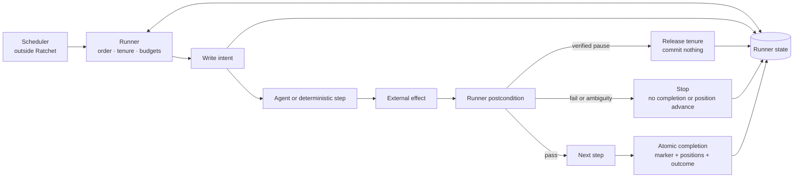

# Architecture

Ratchet Runtime sits below an agent framework and above durable runner state. The scheduler and the
agent's domain judgment remain outside its boundary.



## Responsibility boundary

| Component | Owns | Does not own |
|---|---|---|
| Scheduler | When a run is requested | Whether the run is safe or complete |
| Runner | Order, tenure, intents, budgets, postconditions, positions, completion | Domain judgment |
| Agent step | Judgment and tool use inside one declared step | Sequence, verification, completion, direct state-store access through `RunContext` |
| External system | The real effect and, where available, idempotency/fencing enforcement | Runner state |
| State store | Lock, fencing counter, intents, breaker, run records, completion | Business data |

## State layout

```text
.ratchet-state/
├── .tenure.guard          # persistent flock coordinator
├── lock.json              # current owner and heartbeat
├── tenure_counter.json    # monotonically increasing fencing token
├── intents/<step>.json    # effect may be in flight or orphaned
├── breaker.json           # consecutive failure state
├── runs/<run>.json        # owned terminal outcome
└── completion.json        # marker + source positions + outcome
```

The state root scopes one workflow. Two workflows with a step named `publish` must not share it.
Step names are validated as identifiers before they can become intent filenames.

The coordinator file is not the lock record. It serializes the small local critical section that
reads ownership, allocates the next token, and publishes state. It remains on disk. `lock.json`
describes the current tenure and is deleted or expired on ownership-checked release.

## Effect lifecycle

```text
write intent with stable idempotency key
  → invoke step
  → external effect lands
  → runner evaluates postcondition
  → retain resolved intent
  → continue through later steps
  → atomically commit workflow completion
  → clear resolved intents
```

The ordering above is load-bearing. Clearing an intent immediately after its step would lose
recovery evidence if a later step failed or the process died before workflow completion. If cleanup
itself is interrupted after completion, the next run recognizes an intent carrying the completed
`run_id` as residue and removes it before evaluating a new effect key.

The important recovery path begins when the process dies after the effect but before the result:

```text
orphan intent found
  → read the external system
  → PRESENT: run the normal postcondition, then mark reconciled; do not invoke again
  → ABSENT: retry only when the current idempotency key matches the orphaned key
  → UNKNOWN: retain the intent and stop for human reconciliation
```

This is at-least-once execution with explicit ambiguity handling. Ratchet Runtime does not claim to
manufacture exactly-once behavior across two independent systems.

## Idempotency and fencing solve different races

The runtime evaluates the effect key before writing the intent and exposes both that key and the
current fencing token in `RunContext`:

```python
target.put(
    key=ctx.idempotency_key,   # same logical operation across a retry
    fence=ctx.tenure_token,    # current ownership epoch
    value=payload,
)
```

The idempotency key lets the target deduplicate a retry of the same logical operation. The fencing
token lets a target reject a delayed write from an older owner. A target that accepts neither value
cannot inherit either guarantee merely because Ratchet recorded them locally. The executable
[`effect_recovery.py`](../examples/effect_recovery.py) example implements both checks against a
small file-backed target.

## Why the design uses a guard

Atomic rename prevents torn files but does not compare the value being replaced. The earlier seizure
path performed a read-modify-write on the fencing counter before ownership was serialized, allowing
two concurrent breakers to allocate the same token. Read-back detected some losers but could not
retract a winner that had already returned.

The public runtime uses `flock` to make ownership inspection, token allocation, and publication one
critical section. Runner-state mutations use the same guard, closing the check-then-write gap between
`assert_held()` and the write itself.

This is a deliberate local-filesystem architecture. A distributed deployment should replace the
coordinator with a service that provides linearizable compare-and-set and leases, then retain the
same fencing and effect-integrity contract.

The evaluated alternatives and consequences are recorded in [`ADR-001.md`](ADR-001.md).

## Additive transactional API (0.6.0a1)

`ratchet_sqlite` owns local SQLite leases, attempts, effects, position proposals,
certification and activation. `ratchet_sqlite.contracts` owns only generic typed
execution values. Neither imports the legacy Runner nor any application framework.
The APIs use separate storage and require an explicit consumer choice. See [SQLite](SQLITE.md).
