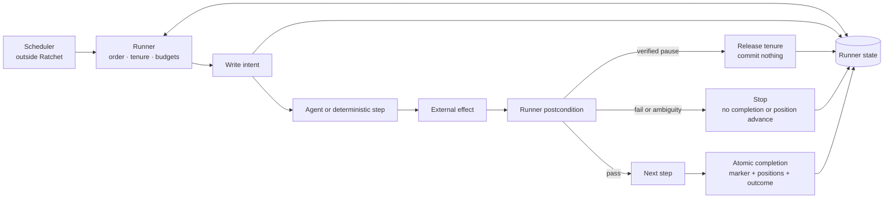

# Architecture

Ratchet Runtime sits below an agent framework and above durable runner state. The scheduler and the
agent's domain judgment remain outside its boundary.



## Responsibility boundary

| Component | Owns | Does not own |
|---|---|---|
| Scheduler | When a run is requested | Whether the run is safe or complete |
| Runner | Order, tenure, intents, budgets, postconditions, positions, completion | Domain judgment |
| Agent step | Judgment and tool use inside one declared step | Sequence, verification, completion |
| External system | The real effect and, where available, idempotency/fencing enforcement | Runner state |
| State store | Lock, fencing counter, intents, breaker, run records, completion | Business data |

## State layout

```text
.ratchet-state/
├── .tenure.guard          # persistent flock coordinator
├── lock.json              # current owner and heartbeat
├── tenure_counter.json    # monotonically increasing fencing token
├── intents/<step>.json    # effect may be in flight or orphaned
├── breaker.json           # consecutive failure state
├── runs/<run>.json        # owned terminal outcome
└── completion.json        # marker + source positions + outcome
```

The coordinator file is not the lock record. It serializes the small local critical section that
reads ownership, allocates the next token, and publishes state. It remains on disk. `lock.json`
describes the current tenure and is deleted or expired on ownership-checked release.

## Effect lifecycle

```text
write intent with stable idempotency key
  → invoke step
  → external effect lands
  → runner evaluates postcondition
  → clear intent
  → continue
```

The important recovery path begins when the process dies after the effect but before the result:

```text
orphan intent found
  → read the external system
  → effect present: mark reconciled, do not invoke again
  → effect absent: retry only through the same idempotency key
  → cannot determine: stop for human reconciliation
```

This is at-least-once execution with explicit ambiguity handling. Ratchet Runtime does not claim to
manufacture exactly-once behavior across two independent systems.

## Why the design uses a guard

Atomic rename prevents torn files but does not compare the value being replaced. The earlier seizure
path performed a read-modify-write on the fencing counter before ownership was serialized, allowing
two concurrent breakers to allocate the same token. Read-back detected some losers but could not
retract a winner that had already returned.

The public runtime uses `flock` to make ownership inspection, token allocation, and publication one
critical section. Runner-state mutations use the same guard, closing the check-then-write gap between
`assert_held()` and the write itself.

This is a deliberate local-filesystem architecture. A distributed deployment should replace the
coordinator with a service that provides linearizable compare-and-set and leases, then retain the
same fencing and effect-integrity contract.
